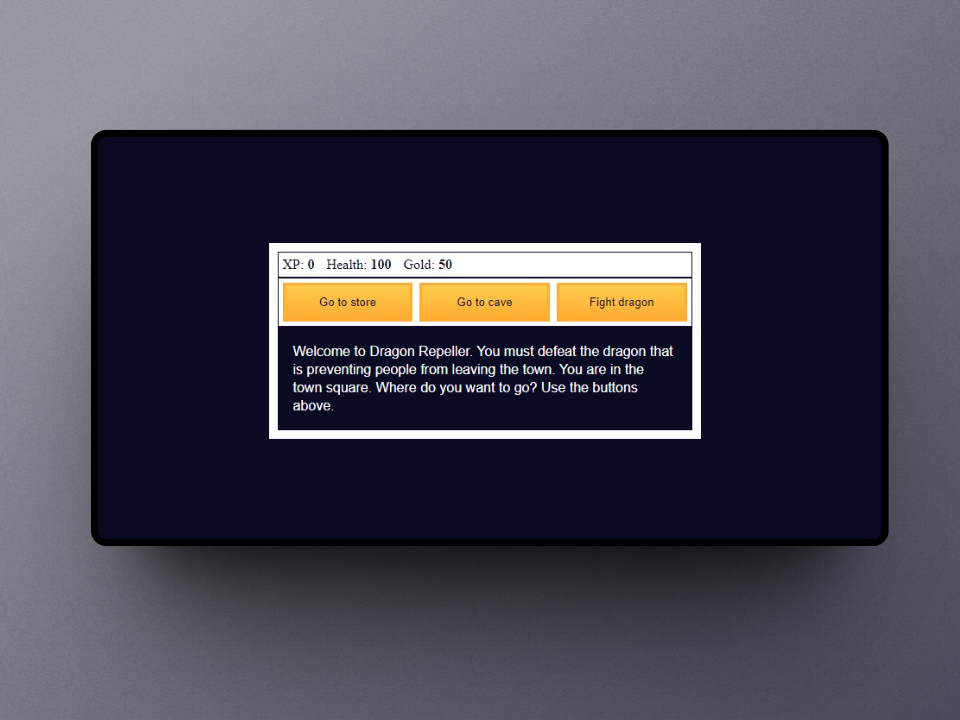

<header align="center" style="border-bottom: 1px solid gray; margin-bottom: 18px;">
    <h3>Role Playing Game</h3>
    
From the course <strong>JavaScript Algorithms</strong> and <strong>Data Structures</strong> on <a href="https://www.freecodecamp.org/learn/javascript-algorithms-and-data-structures-v8/">freecodecamp.org</a>

</header>

I have typed the code using Typescript (originally in Javascript) and I have used Vite as a bundle for its simplicity. I have divided the code into ES Modules for legibility (there is still work to do). Lastly, I also improved the styles by creating some variables

###Stack

<ul>
<li><a target="_blank" href="https://vitejs.dev/">Vite</a> - Next Generation Frontend Tooling</li>
<li><a target="_blank" href="https://www.typescriptlang.org/">Typescript</a> - JavaScript con sintaxis de tipado.</li>
</ul>
